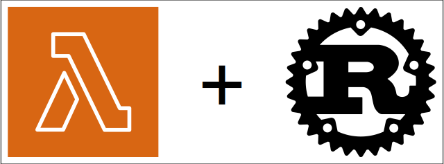

[AWS Lambda](https://aws.amazon.com/lambda/) is one of the most used AWS services in the serverless
category. For those who are not familiar with the concept, _serverless_ means that you, as a user,
should not have to worry about the underlying compute infrastructure provisioning and maintenance.
Your sole responsibility is packaging the code you want to be run in response to certain triggers.
AWS Lambda is an ideal choice in situations when you have a self-contained piece of logic that you
want to be executed in response to external events. Leveraging this concept, together with other
fully-managed AWS services, it is possible to build quite sophisticated systems, without having to
worry about managing the infrastructure &ndash; a task that usually requires a lot of experience and time.

## AWS Lambda architecture overview

')

In order to understand how to create your own instance of Lambda, it is important to understand, at
least on a basic level, the service architecture. AWS Lambda consists of several components:
Lambda service (managed by AWS) and execution environment (managed by the user). The Lambda service
is what enables triggering Lambda function calls and integration with other services. The execution
environment wraps around the actual Lambda function and its (optional) extensions. These two
components are connected by the standard API layer that the Lambda service implements. The API consists
of three parts: Runtime API, Extensions API, and Telemetry API (see
[docs](https://docs.aws.amazon.com/lambda/latest/dg/lambda-runtime-environment.html) for more
details). The execution environment acts as a client of the API implemented by the Lambda service. For
example, Runtime API is used by the execution environment to get notified when the function must be
triggered.

## How do I get started?

Based on this very high-level overview, it is clear that we, as users, are responsible for setting
up the execution environment that upon start communicates with the Lambda service via the
pre-defined API. You should not be worried about this too much since AWS provides tools to make
this task quite smooth. In particular, many of the popular programming languages have a
[pre-packaged managed runtime](https://docs.aws.amazon.com/lambda/latest/dg/lambda-runtimes.html)
maintained by AWS and a pretty good documentation with examples. The managed runtimes require the
user to provide only the Lambda function source code to bootstrap a proper execution environment.
Rust is one of those languages that have partial support from AWS, meaning that you need to do a
bit more work than with Python or JavaScript, for example, to set up your Lambda.

> **Note**: If you intend to use a language that does not have a [runtime interface
> client](https://docs.aws.amazon.com/lambda/latest/dg/images-create.html#images-ric) or if the
> provided runtime version is not what you want, then you will have to
> [implement](https://docs.aws.amazon.com/lambda/latest/dg/runtimes-custom.html) the custom runtime
> yourself (see also OpenAPI specification in the
> [docs](https://docs.aws.amazon.com/lambda/latest/dg/runtimes-api.html)).

In case of Rust, we are lucky that AWS provides an experimental but [rather
stable](https://www.reddit.com/r/rust/comments/136ukbd/comment/jis7kz7/?utm_source=share&utm_medium=web2x&context=3)
implementation of the [runtime interface client for
Rust](https://github.com/awslabs/aws-lambda-rust-runtime). However, there is no pre-packaged
managed runtime that automatically wraps your code together with the runtime interface client (in
contrast to officially supported languages) into an execution environment, so we will have to make
it ourselves. This is done with the help of a special [OS-only
runtime](https://docs.aws.amazon.com/lambda/latest/dg/runtimes-provided.html) &ndash; a lower-level runtime
that provides only an Amazon Linux OS environment with a C standard library.

## Show me the code!

Okay, enough introduction, let's get started! If you are reading this article, you probably know
about the Rust package manager called **cargo**. AWS provide a [cargo
module](https://www.cargo-lambda.info/) that allows to bootstrap, run, build, and deploy functions
on AWS Lambda using a convenient command-line interface. Before you install this module, make sure
that you have [Rust toolchain installed](https://www.rust-lang.org/tools/install) on your machine.
Next, we should install the cargo-lambda module,

```shell
pipx install cargo-lambda
```

There are [multiple ways to install](https://www.cargo-lambda.info/guide/installation.html) the
module, but it is generally recommended to install pre-built binaries.

### Bootstrap

Now, we are ready to get started. Bootstraping the function source is easy,

```shell
cargo lambda new aws-lambda-tutorial
```

You will be prompted to answer a few questions:

```
? Is this function an HTTP function? (y/N) N
[type `yes` if the Lambda function is triggered by an API Gateway, Amazon Load Balancer(ALB), or a Lambda URL]
```

to decide whether you want your function to respond to HTTP events, and

```
? AWS Event type that this function receives
  activemq::ActiveMqEvent
  autoscaling::AutoScalingEvent
  chime_bot::ChimeBotEvent
  cloudwatch_events::CloudWatchEvent
  cloudwatch_logs::CloudwatchLogsEvent
  cloudwatch_logs::CloudwatchLogsLogEvent
v codebuild::CodeBuildEvent
[↑↓ to move, tab to auto-complete, enter to submit. Leave it blank if you don't want to use any event from the aws_lambda_events crate]
```

to choose the event payload type. The latter allows to quickly create a function that integrates
with other AWS services. If you do not choose anything in the last prompt, you will get a generic
function,

```rust
use lambda_runtime::{run, service_fn, Error, LambdaEvent};
use serde::{Deserialize, Serialize};

#[derive(Deserialize)]
struct Request {
    command: String,
}

#[derive(Serialize)]
struct Response {
    req_id: String,
    msg: String,
}

async fn function_handler(event: LambdaEvent<Request>) -> Result<Response, Error> {
    let command = event.payload.command;

    let resp = Response {
        req_id: event.context.request_id,
        msg: format!("Command {}.", command),
    };

    Ok(resp)
}

#[tokio::main]
async fn main() -> Result<(), Error> {
    tracing_subscriber::fmt()
        .with_max_level(tracing::Level::INFO)
        // disable printing the name of the module in every log line.
        .with_target(false)
        // disabling time is handy because CloudWatch will add the ingestion time.
        .without_time()
        .init();

    run(service_fn(function_handler)).await
}
```

Another popular choice is to accept a generic JSON object. In this case you would use `serde_json`
crate, and `serde_json::Value` struct as payload,

```rust
use lambda_runtime::{service_fn, LambdaEvent, Error};
use serde_json::{json, Value};

async fn handler(event: LambdaEvent<Value>) -> Result<Value, Error> {
    let payload = event.payload;
    let command = payload["command"].as_str().unwrap_or("empty");
    Ok(json!({
        "req_id": event.context.request_id,
        "msg": format!("Command {command}.")
    }))
}

#[tokio::main]
async fn main() -> Result<(), Error> {
    tracing_subscriber::fmt()
        .with_max_level(tracing::Level::INFO)
        // disable printing the name of the module in every log line.
        .with_target(false)
        // disabling time is handy because CloudWatch will add the ingestion time.
        .without_time()
        .init();

    lambda_runtime::run(service_fn(handler)).await
}
```

At this point, this is just a Rust project, and you are free to install any other crates you need
and implement the handler logic.

### Test

When you think you are ready to try running your function, you can do it with a few commands.
First, in the root of your project, run

```shell
cargo lambda watch
```

This will start the emulated AWS Lambda environment on your machine that you can interact with via
another command,

```shell
cargo lambda invoke --data-ascii '{ "command": "hello" }'
```

Note that the commands mentioned above are great for running your function locally, but they do not
replace proper unit testing of the handler logic.

### Build and deploy

Now, when you think your function is ready to be deployed to your AWS account, it is time to build
a release binary,

```shell
cargo lambda build --release [--arm64]
```

This command will generate a single executable binary in `target/lambda/aws-lambda-tutorial/bootstrap`.
The generated binary bootstraps a proper AWS Lambda execution environment, as we discussed above.
If you provide the optional `--arm64` flag, the built binary can be deployed to AWS machines with
Graviton processor (implement ARM 64-bit instruction set architecture), which is often cheaper than
x86-64.

Deploying the binary can also be done with just one command,

```shell
cargo lambda deploy [--iam-role FULL_ROLE_ARN] [--profile PROFILE_NAME]
```

If you omit the `--iam-role` option, a new IAM role will be created for you upon deployment. By
default, the attached policy should at least be allowed to [send logs to AWS
CloudWatch](https://docs.aws.amazon.com/lambda/latest/operatorguide/access-logs.html),

```json
{
  "Version": "2012-10-17",
  "Statement": [
    {
      "Effect": "Allow",
      "Action": "logs:CreateLogGroup",
      "Resource": "arn:aws:logs:<region>:<accountID>:*"
    },

    {
      "Effect": "Allow",
      "Action": ["logs:CreateLogStream", "logs:PutLogEvents"],
      "Resource": [
        "arn:aws:logs:<region>:<accountID>:log-group:/aws/lambda/<functionName>:*"
      ]
    }
  ]
}
```

If you omit the `--profile` option, the default profile will be used. Note that to run the `deploy`
command you need [AWS
credentials](https://docs.aws.amazon.com/cli/latest/userguide/cli-configure-files.html) to be set
up. At this point, you should have a fully-functioning Lambda deployed to your account.

## Final thoughts

I have discussed a high-level overview of the AWS Lambda architecture and how you can get started
with creating functions with Rust. We looked at Lambda lifecycle management with the help of a
convenient command-line interface provided by the [cargo-lambda](https://www.cargo-lambda.info/)
module. I encourage you to explore the documentation of the module and various options that can be
supplied to `cargo lambda` subcommands.

The approach discussed in this part is alright for one-off functions that can be easily maintained
with this manual process. This approach does not scale, however, if you need to work in a team
and/or have many such functions to deal with. In the next part of this series, we will look at how
the deployment process can be automated using Terraform and CI/CD pipelines.
